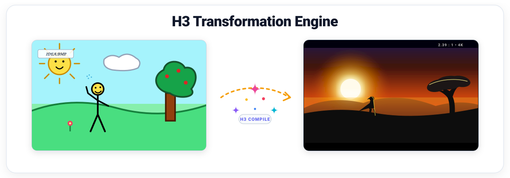

<p align="center">
  
</p>

<p align="center">
  <strong>A deterministic prompt compiler and structured IR editor for MiniMax H3.</strong><br>
  Turns prompts into data: the saved artifact is a document, and the prompt text is a pure function of it.
</p>

<p align="center">
  <a href="#quickstart">Quickstart</a> •
  <a href="#core-invariants">Core Invariants</a> •
  <a href="#pipeline">Pipeline</a> •
  <a href="#knowledge-base-llm-wiki">LLM-Wiki</a> •
  <a href="#security--privacy">Security</a>
</p>

---

> **Prompt-only.** Nothing here generates video. The engine produces byte-exact, specification-compliant multimodal conditioning prompts and character-level source maps for MiniMax H3 video generation models (`T2VA`, `I2VA`, `FL2VA`, `L2VA`, and `Ref2VA`).

---

## Core Invariants

1. **Beats carry prose; enums are validated annotations.**  
   The planner writes the actual descriptive sentences. The serializer only assembles structure around them (labels, timestamps, tags, section headers, alignment lines, ordering) and never expands an enum into a sentence. H3 conditions on descriptive quality; canned clauses produce the "detached command stack" vendor guides explicitly warn against.
2. **The prompt text is a pure function of the document.**  
   `serialize(doc, ctx)` is total, pure, and deterministic. Hand-editing prompt text is prohibited because derived values (alignment lines, shot numbers, cut times, label ordinals) would fall out of sync. All mutations occur on the document AST via `applyPatch()` or direct editor actions.

---

## Pipeline

```
CompileInput ──► normalize() ──► InferenceClient.call() ──► assemble() ──► validate() ──► serialize() ──► Prompt + SourceMap
                       │                                                  ▲
                       ▼                                                  │
                NormalizedContext                                  [applyPatch()]
```

---

## Knowledge Base (LLM-Wiki)

The repository contains an exhaustive, 19-document knowledge base inside [`wiki/`](./wiki/index.md) (>300 KB total) verified by an automated test harness:

| Subsystem | Scope & Highlights | Wiki Guide |
|---|---|---|
| **Master Index** | Master sitemap, subsystem architecture matrix, verification quickstart | [`wiki/index.md`](./wiki/index.md) |
| **Architecture & Pipeline** | 6 pure compiler stages, timing models, 24 FPS frame math, data flow | [`wiki/architecture.md`](./wiki/architecture.md) |
| **Core Invariants** | Foundational laws, strict purity boundaries (`test/purity.test.ts`) | [`wiki/invariants.md`](./wiki/invariants.md) |
| **Intermediate Representation** | Canonical `H3Document`, Zod schemas, 19 `PATCHABLE_LEAVES`, `vocab.ts` | [`wiki/core_ir.md`](./wiki/core_ir.md) |
| **Normalization** | 24 FPS $17k+5$ frame math, label counters, mode inference, duration budgets | [`wiki/core_normalize.md`](./wiki/core_normalize.md) |
| **Validation Engine** | 29 rules, all 36 diagnostic error codes, red-proving fixtures | [`wiki/core_validate.md`](./wiki/core_validate.md) |
| **Serialization** | Base modes vs Ref2VA, alignment lines, character-level source mapping | [`wiki/core_serialize.md`](./wiki/core_serialize.md) |
| **Patch Subsystem** | 4-gate verification, dialogue protection, immutable structural sharing | [`wiki/core_patch.md`](./wiki/core_patch.md) |
| **Creative Engine** | 4 pack families (53 packs), 30 anchors (`R01`–`R30`), 5 leverage axes | [`wiki/core_creative.md`](./wiki/core_creative.md) |
| **Glitch Marks** | 10 tokenizer anomaly strings, 6 placement surfaces, mode restrictions | [`wiki/glitch_marks.md`](./wiki/glitch_marks.md) |
| **Wildcards & Matrix** | 12 categories, 122 values, seeded `mulberry32` PRNG, experiment matrix | [`wiki/wildcards.md`](./wiki/wildcards.md) |
| **Provider Layer** | `InferenceClient`, Gemini vs local heylook, trailers, defensive JSON parsing | [`wiki/provider.md`](./wiki/provider.md) |
| **Crypto & Vault** | Client-side AES-GCM-256 / PBKDF2 (310k iterations), `H3KeyVault` | [`wiki/crypto.md`](./wiki/crypto.md) |
| **Database Architecture** | IndexedDB 3 stores, versionless healing (`openHealed`), immutable version tree | [`wiki/db.md`](./wiki/db.md) |
| **Telemetry & Debug** | Circular event bus (800 events / 4MB), automatic redaction, UI console | [`wiki/debug.md`](./wiki/debug.md) |
| **UI Workbench** | React component hierarchy, `useEngine` single-state hook, serial edit queue | [`wiki/ui.md`](./wiki/ui.md) |
| **Operational Policy** | 4-tier policy resolution cascade, concurrency limits, UI settings | [`wiki/policy.md`](./wiki/policy.md) |
| **Discrepancy Audit** | 29 forensic entries comparing documentation claims to code ground truth | [`wiki/code_doc_discrepancies.md`](./wiki/code_doc_discrepancies.md) |
| **Verification Harness** | 4-tier automated test suite specification, CLI flags, troubleshooting | [`wiki/verification_harness.md`](./wiki/verification_harness.md) |
| **Lessons Learned** | Traps & failure modes synthesized from all 4 engineering postmortems | [`wiki/postmortems_lessons.md`](./wiki/postmortems_lessons.md) |

---

## Quickstart

### Commands

```bash
bun install
bun run dev         # Launch local workbench at http://localhost:5173
bun run test        # Run Vitest test suite (921 tests across 28 test suites)
bun run typecheck   # Static typecheck with tsc --noEmit
bun run build       # Build production bundle with Vite
bun run probe       # Live API probes (reads GEMINI_API_KEY from .env)
```

### Knowledge Base Verification

The wiki test harness checks link integrity, heading anchor validity, and symbol correspondence against `src/`:

```bash
bun run wiki/verify.ts
```

---

## Security & Privacy

Everything runs client-side in your browser. There is no account, no backend, and no telemetry server owned by this project.

- **API Keys**: Stored in `localStorage` encrypted via AES-GCM-256 (`origin` mode, key non-extractable in IndexedDB) or PBKDF2 (`passphrase` mode, 310,000 iterations). See [`wiki/crypto.md`](./wiki/crypto.md).
- **Documents & History**: Stored unencrypted in IndexedDB (`H3TransformationEngine`), scoped to your browser profile origin. See [`wiki/db.md`](./wiki/db.md).
- **Inference Routing**: Prompts go directly to your chosen provider: Google Gemini (`generativelanguage.googleapis.com` with `store: false`) or a local **heylook** server on your private network. No automatic fallback. See [`wiki/provider.md`](./wiki/provider.md).
- **Data Erasure**: The `local data` button re-reads storage after deletion to verify clean removal. See [`wiki/db.md`](./wiki/db.md).

---

## Verification Discipline

- **Byte-Exact Vendor Fidelity**: Golden fixtures reproduce official MiniMax worked examples byte-for-byte with ASCII apostrophe validation ([`test/guide-fidelity.test.ts`](./test/guide-fidelity.test.ts)).
- **Computational Purity**: `src/core/` is verified pure TypeScript—zero React, DOM, network, or DB imports ([`test/purity.test.ts`](./test/purity.test.ts)).
- **Control Coverage**: Every one of the 36 diagnostic error codes has an active test fixture that forces it red ([`test/validate.test.ts`](./test/validate.test.ts)).
- **Zero Warnings**: The validator emits errors only for provably malformed documents; subjective stylistic checks live exclusively in planner prompts.
